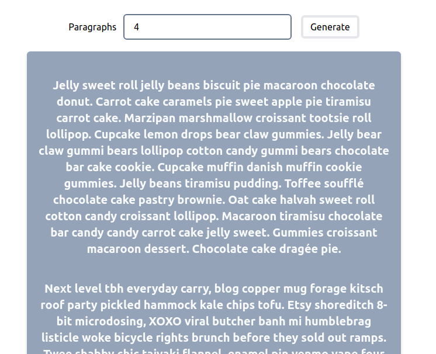

# Nano React App Default Javascript Template



The default template project for [nano-react-app](https://github.com/nano-react-app/nano-react-app).

- `npm start` — This will spawn a development server with a default port of `3000`.
- `npm run build` — This will output a production build in the `dist` directory.

## Custom port

You can use the `-p` flag to specify a port for development. To do this, you can either run `npm start` with an additional flag:

```
npm start -- --port 1234
```

Or edit the `start` script directly:

```
vite --port 1234
```

# Features
- Type the number of paragraphs to generate using the input field
- Generate button is used to show the lorem epsum text
- Maximum 8 and minimum 1 paragraphs could be displayed
- Edge cases of negative and greater than 8 is handled 
